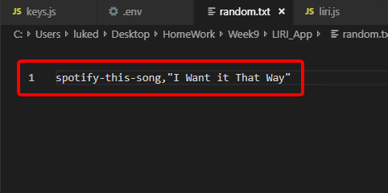

# LIRI_App

LIRI is supposed to act as a _**L**anguage **I**nterpretationm and **R**ecognition **I**nterface_

Meaning it takes what you type it, and does an action based on what you type.

# So far, **LIRI** only process **4 commands**.

## 1. concert-this
    1. Displays the following information (for up to 4 events) using the Bandsintown API:
        1. Name of the venue
        2. Venue location
        3. Date of the Event ( In "MM/DD/YYYY")
## 2. spotify-this-song
    1. Displays the following information (for up to 3 events) using the Spotify API:
        1. Artist(s)
        2. The song's name
        3. A preview link of the song from Spotify
        4. The album that the song is from
## 3. movie-this
    1. Displays the following information using the OMDB Api:
        1. Title of the movie.
        2. Year the movie came out.
        3. IMDB Rating of the movie.
        4. Rotten Tomatoes Rating of the movie.
        5. Country where the movie was produced.
        6. Language of the movie.
        7. Plot of the movie.
        8. Actors in the movie.

## 4. do-what-it-says
    1. Reads in the contents of the random.txt file and processes accordingly.
    2. This function is currently built to only handle 1 line of text in the following format:
        1. [command],[searchString]

Not only will these commands display the appropriate responses on the console log, it will also write each search result to a log.txt file. found in the same directory.

**IMPORTANT**

If you clone this to your machine, user must create and populate their own .env file (within local directory) and populate it with a spotifyID and SecretKey.

To use within terminal, user must call "node liri.js [command] [searchTerm]"

If you run other commands or forget to supply a searchTerm, the app will either give you a gentle reminder to do so, or default to a preset search term.

If you want to increase the amount of information returned from some of the commands (IE, concert-this returning more than 4, you'll have to change the hardcoded preset within the Liri.js file);

